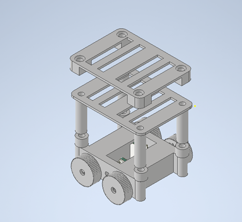

# Mechanical Design — Mini TurtleBot

This folder contains the **3D printable STL files** for the Mini TurtleBot chassis and related components.  
All parts are designed to be fabricated on a standard FDM 3D printer (e.g., Prusa, Ender, Bambu Lab).  

---

## File Overview

| File                  | Description                                                                 |
|-----------------------|-----------------------------------------------------------------------------|
| `Frame.stl`           | Main chassis frame that holds the Pico-W board, LiDAR, and mounting points. |
| `Battery_Base.stl`    | Bottom housing for LiPo battery.                                             |
| `Battery_Top.stl`     | Top cover/retainer for the battery compartment.                              |
| `Gear_Wheel.stl`      | Use this to print wheel and use TPU for better performance.                                |
| `Small_Gear12.stl`    | Secondary small gear (12T) for transmission system.                         |
| `Small_Spacer.stl`    | Spacer for aligning gears/axles.                                            |
| `Mini_turtle_assembly.bmp` | Assembly illustration for reference (non-printable).                    |
| `Spur_gear_for_wheel.stl` |  Primary drive wheel gear for motor coupling.                    |

---

## Printing Recommendations

- **Material:** PLA+ or PETG recommended (PLA+ for easy prototyping, PETG for durability).
- **Layer Height:** 0.2 mm  
- **Infill:** 20–30% (gears: ≥40% for strength)  
- **Perimeters:** 3 walls  
- **Supports:** Only needed for `Frame.stl` (depending on printer).  
- **Orientation:**  
  - Wheels and gears: flat on build plate.  
  - Frame and battery housing: oriented upright with minimal supports.

---

## Assembly Notes

1. Print all parts and check tolerances.  
2. Attach **Gear_Wheel** and **Small_Gear12** with the provided **Small_Spacer** to motor shafts.  
3. Mount **Battery_Base** and secure the battery with **Battery_Top**.  
4. Use **Frame.stl** as the main chassis; all other parts attach onto it.  
5. Refer to `Mini_turtle_assembly.bmp` for an exploded-view style reference of how parts fit together.

---

## Customization

- Parameters such as wheel size or gear ratio can be adjusted in the source CAD files (not included here, but recommended to keep in `/hardware/mech/source/`).
- STL files are export-ready; ensure units are set to **millimeters**.

---

## License

These mechanical design files are released under the same open-source license as the rest of the Mini TurtleBot repository (MIT License).

