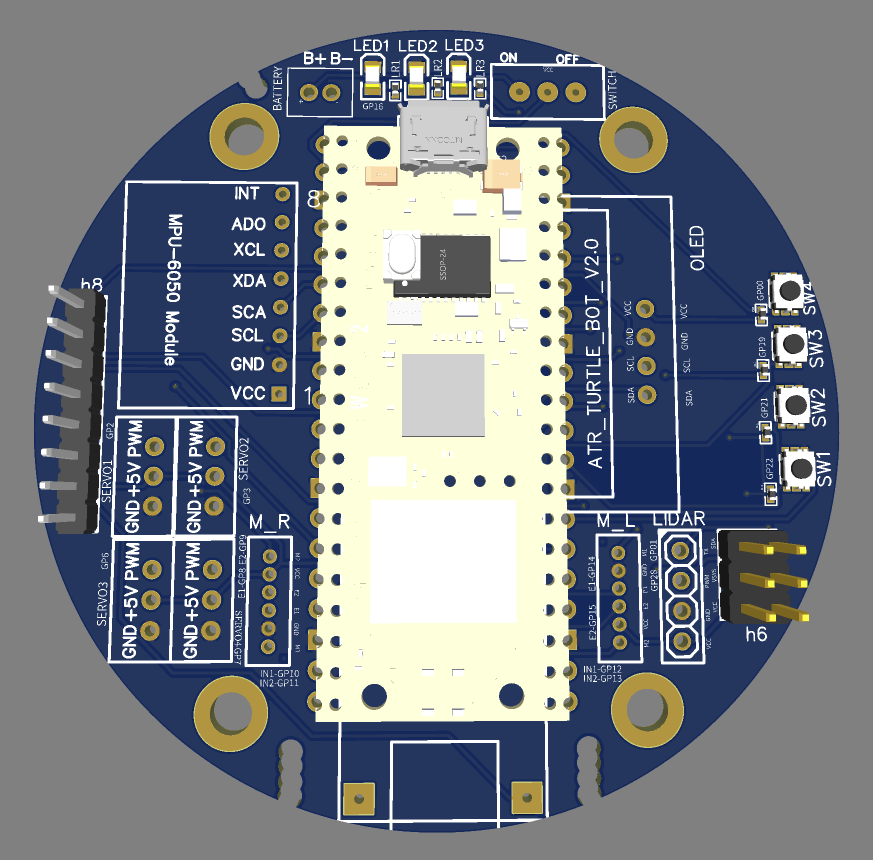
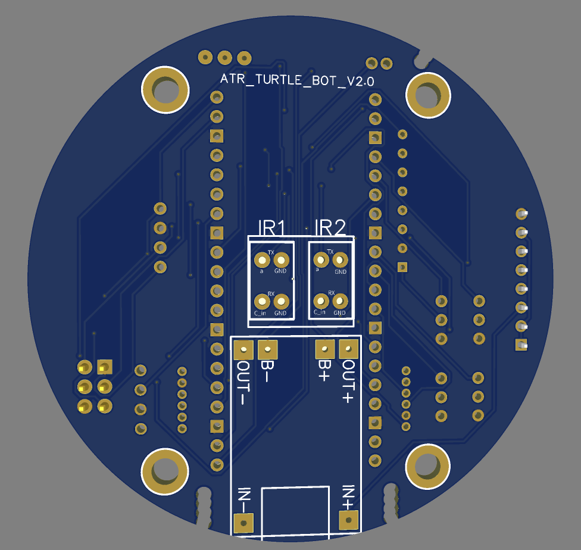

# PCB Design — Mini TurtleBot

This folder contains the **circuit design files** for the Mini TurtleBot platform.  
It includes the schematic, PCB layout, Gerber files, and render previews.

---

## File Overview

| File                           | Description                                                                 |
|--------------------------------|-----------------------------------------------------------------------------|
| `ATR_mini_turtlebot.pdf`       | PCB schematic and layout in PDF format.                                     |
| `Gerber_atr_mini_turtlebot.zip`| Gerber package ready for PCB manufacturing (upload to your PCB fab service).|
| `.keep`                        | Placeholder for version control.                                            |

---

## Design Overview

- Compact **round PCB** designed to fit the Mini TurtleBot chassis.  
- Hosts the **Raspberry Pi Pico W** module at the center.  
- Breakout connectors for:
  - **Motors & Servos** (PWM headers)  
  - **LiDAR** module  
  - **IR sensors** (IR1 / IR2)  
  - **OLED display**  
  - **MPU-6050 IMU**  
- Integrated **battery connector**, power switch, and indicator LEDs.  
- Optimized for **educational assembly** and **research prototyping**.

---

## PCB Renders

Top view with component placement:

3D assembled render:

---

## Fabrication Notes

- **Board size:** ~75 mm circular (fits robot frame).  
- **Layers:** 2-layer PCB.  
- **Copper weight:** 1 oz copper recommended.  
- **Finish:** HASL (low cost) or ENIG (better durability).  
- **Min track/spacing:** 6/6 mil (compatible with JLCPCB, PCBWay, OSH Park).  

Upload the provided **Gerber ZIP** to a PCB manufacturer for fabrication.

---

## Assembly Notes

- Mount the **Pico W** on headers (allows easy replacement/debugging).  
- Solder motor drivers, connectors, and sensors as per schematic.  
- Pay attention to **battery polarity** and **orientation of ICs**.  
- LEDs and push buttons are optional but recommended for debugging.  

---

## Disclaimer

These PCB design files are provided **as-is** for educational and research use.  
Always verify footprints and component orientation before ordering boards.
